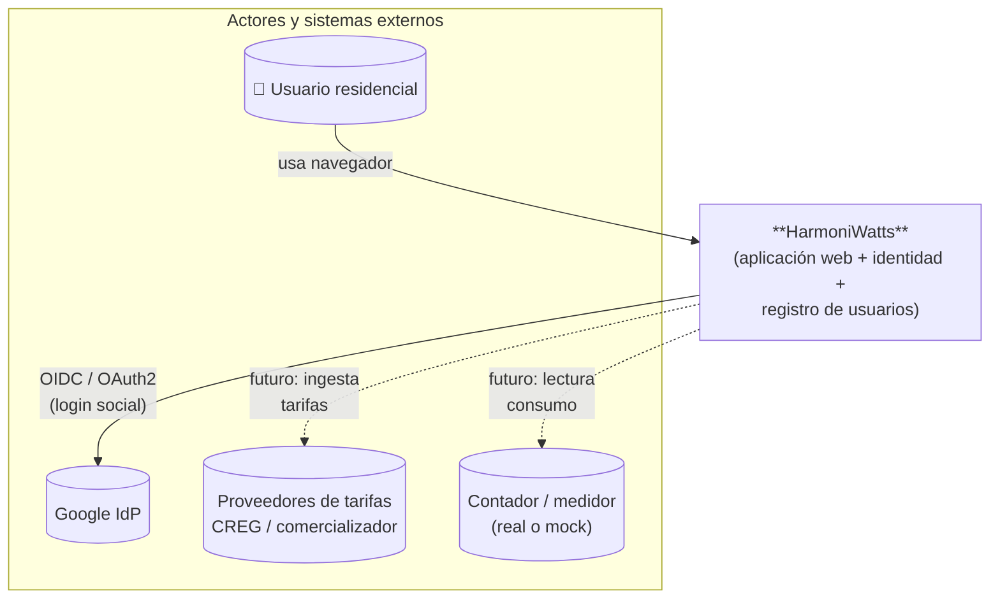
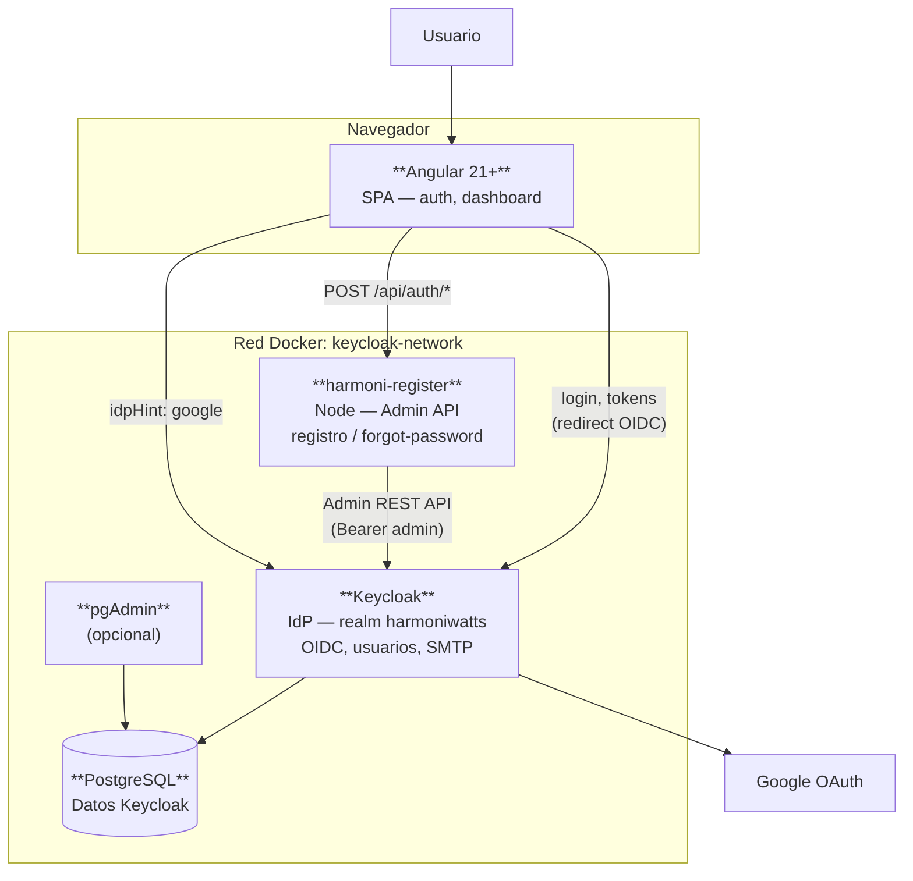
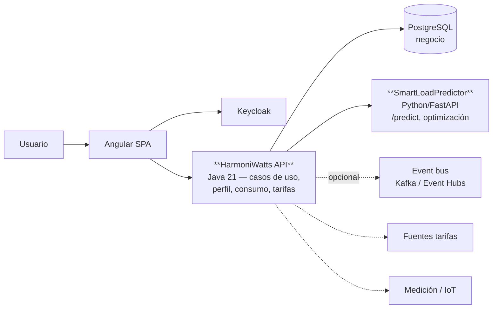
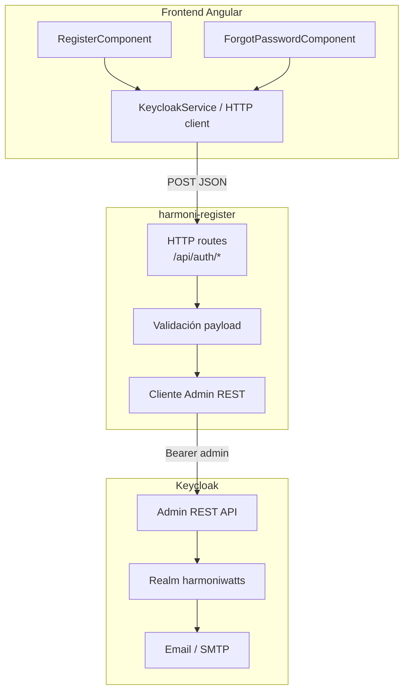
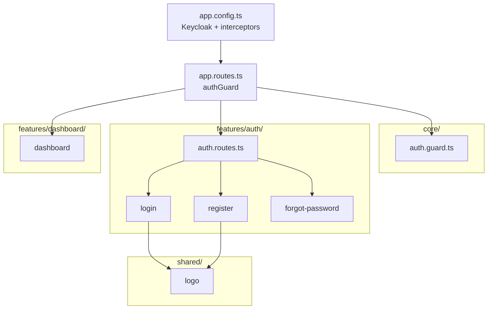
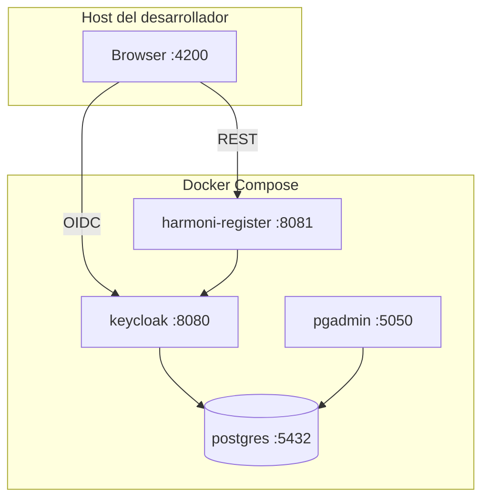
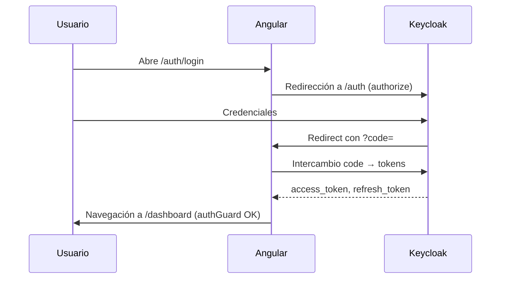
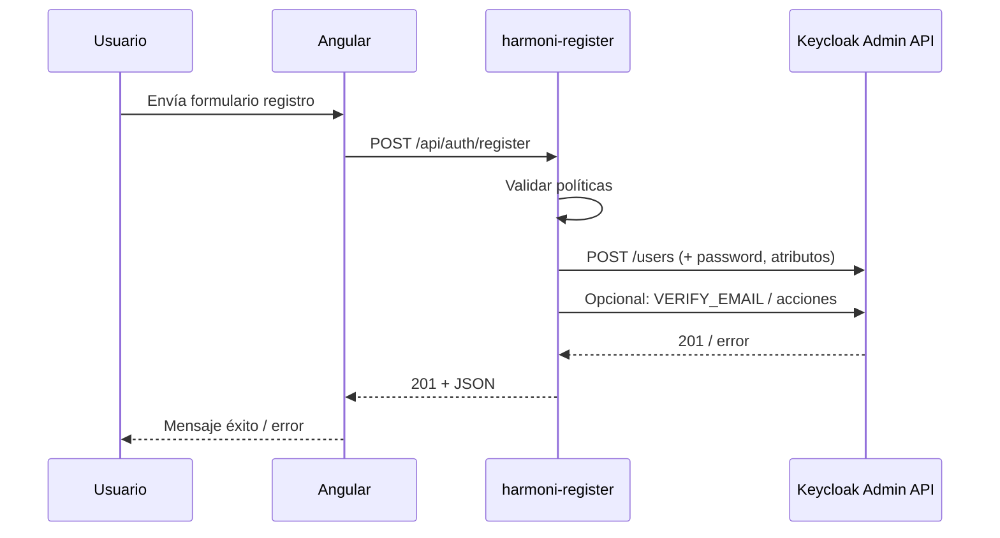
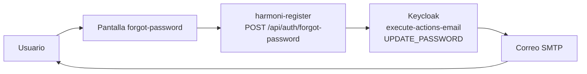

# Arquitectura técnica — HarmoniWatts

Documento de referencia para **diagramas de componentes**, **flujos** y **vista de despliegue**. Complementa el [modelo de negocio BPM](HarmoniWatts_BPM.md), el [plan de releases](HarmoniWatts_ReleasePlan.md) y la documentación de [autenticación](AUTH-FLOW.md) / [registro](REGISTER-API.md).

---

## 1. Propósito y alcance

**HarmoniWatts** es un HEMS (Home Energy Management System) orientado a optimizar consumo frente a tarifas horarias (TOU/RTP) y perfiles residenciales. Este documento describe:

- La **arquitectura implementada hoy** (frontend Angular, IdP Keycloak, microservicio de registro, PostgreSQL).
- La **arquitectura objetivo** alineada con el backlog (microservicio de dominio en Java, predictor de carga, mensajería, nube).
- **Diagramas** en [Mermaid](https://mermaid.js.org/) (renderizan en GitHub, GitLab, VS Code y muchas herramientas Markdown).

**Convención de capas (hexagonal / limpia):** el dominio energético y las reglas de negocio deben vivir en el núcleo, sin depender de frameworks; los adaptadores (REST, BD, Keycloak, UI) implementan puertos. El repositorio actual concentra identidad en Keycloak y UI en Angular; el backend de negocio se incorporará como servicios adicionales.

---

## 2. Diagrama de contexto (C4 — Nivel 1)

Actores y sistema en su entorno. El “sistema HarmoniWatts” aquí incluye lo desplegable hoy más los límites hacia proveedores externos.



---

## 3. Diagrama de contenedores — estado actual

Lo que existe en el repositorio y en `docker-compose.yml` (desarrollo).



| Contenedor | Rol | Puerto típico (host) |
|------------|-----|----------------------|
| Angular | UI, `keycloak-angular`, rutas protegidas | 4200 (dev) |
| Keycloak | Emisión de tokens, políticas, verificación de email | 8080 |
| PostgreSQL | Persistencia del servidor Keycloak | 5432 |
| harmoni-register | Creación de usuarios y acciones de email sin exponer credenciales admin al navegador | 8081 |
| pgAdmin | Administración visual de PostgreSQL | 5050 |

---

## 4. Diagrama de contenedores — visión objetivo (roadmap)

Alineado con [HarmoniWatts_ReleasePlan.md](HarmoniWatts_ReleasePlan.md): orquestación vía API de dominio, predictor de carga y persistencia de negocio. Las tecnologías de referencia del proyecto: **Java 21**, **Angular 21+**, **PostgreSQL**.



La comunicación entre módulos de IA y el API de dominio debe hacerse **a través de contratos** (REST u eventos), no con acoplamiento directo a la base de datos del otro servicio.

---

## 5. Diagrama de componentes — harmoni-register + Keycloak (registro)

Desglose lógico del flujo “formulario propio → Keycloak”.



---

## 6. Diagrama de componentes — frontend Angular (módulos relevantes)

Estructura actual bajo `frontend/src/app/` (feature folders + núcleo).



---

## 7. Diagrama de despliegue (Docker Compose)

Relación física/lógica de artefactos en desarrollo (puertos configurables vía `.env`).



Variables y secretos: ver comentarios en [`docker-compose.yml`](../docker-compose.yml) y `.env.example` (no commitear secretos).

---

## 8. Flujos técnicos

### 8.1 Login con usuario y contraseña (OIDC Authorization Code)



Detalle narrativo: [AUTH-FLOW.md](AUTH-FLOW.md).

### 8.2 Registro desde formulario Angular (sin página de registro de Keycloak)



Contrato del payload: [REGISTER-API.md](REGISTER-API.md).

### 8.3 Olvidé mi contraseña (vista propia)



Respuesta siempre genérica (p. ej. 200) para no filtrar existencia de cuentas.

### 8.4 Flujo de negocio HEMS (alto nivel — alinea con BPM)

Versión técnica del proceso descrito en [HarmoniWatts_BPM.md](HarmoniWatts_BPM.md); varias cajas son **futuras** hasta completar el backlog.

```mermaid
flowchart TD
    A[Autenticación OK] --> B[Perfil vivienda / cargas]
    B --> C[Ingesta consumo\n(mock o real)]
    C --> D[Almacenamiento\nserie temporal / agregados]
    D --> E[Ingesta tarifas\nTOU/RTP]
    E --> F[Predicción STLF]
    F --> G[Análisis oportunidad]
    G --> H[Optimización horaria\n+ restricciones confort]
    H --> I[Recomendaciones en UI]
    I --> J{Usuario aplica?}
    J -->|Sí| K[Feedback / telemetría]
    J -->|No| L[Registro de descarte]
    K --> M[Actualización modelos\n(aprendizaje continuo)]
    L --> M
```

---

## 9. Matriz de trazabilidad documentación ↔ artefactos

| Tema | Documento | Código / infra |
|------|-----------|----------------|
| Realm, cliente OIDC, Google | [KEYCLOAK-REALM-CLIENT.md](KEYCLOAK-REALM-CLIENT.md) | `keycloak-realm/` |
| Docker, import realm | [DOCKER-KEYCLOAK.md](DOCKER-KEYCLOAK.md) | `docker-compose.yml` |
| SMTP | [KEYCLOAK-SMTP.md](KEYCLOAK-SMTP.md) | Variables `KC_SPI_EMAIL_*` |
| Auth en Angular | [AUTH-FLOW.md](AUTH-FLOW.md) | `frontend/src/app/app.config.ts`, `auth.guard.ts` |
| Registro API | [REGISTER-API.md](REGISTER-API.md) | `harmoni-register/` |
| Proceso de negocio | [HarmoniWatts_BPM.md](HarmoniWatts_BPM.md) | `HarmoniWatts_BPM.drawio` |
| Planificación | [HarmoniWatts_ReleasePlan.md](HarmoniWatts_ReleasePlan.md) | — |

---

## 10. Decisiones y riesgos (resumen)

| Decisión | Motivo |
|----------|--------|
| Keycloak como IdP | Estándar OIDC, políticas de contraseña, verificación de email, broker Google |
| harmoni-register separado | No exponer credenciales de administración en el navegador; validación y rate limiting en servidor |
| PostgreSQL para Keycloak | Persistencia durable; mismo motor previsto para datos de negocio (consistencia operativa) |
| Angular standalone + guards | Alineado con Angular 21+ y rutas protegidas por token |

| Riesgo | Mitigación |
|--------|------------|
| Credenciales admin en el microservicio de registro | En producción: service account con roles mínimos; rotación de secretos; sin logs de contraseñas |
| SMTP mal configurado | Verificación de email y reset no llegan; revisar [KEYCLOAK-SMTP.md](KEYCLOAK-SMTP.md) |
| CORS entre :4200 y :8081 | Configurar orígenes permitidos en harmoni-register o proxy en desarrollo |

---

## 11. Cómo editar o exportar diagramas

- **Mermaid:** este archivo se puede abrir en VS Code con extensión Mermaid, o pegar bloques en [diagrams.net](https://app.diagrams.net) vía plugins, o usar [Mermaid Live Editor](https://mermaid.live).
- **BPMN detallado:** [HarmoniWatts_BPM.drawio](HarmoniWatts_BPM.drawio) (si existe junto al `.md`) en draw.io.
- Para **informes PDF**, exportar desde la herramienta que renderice Mermaid o adjuntar capturas de los gráficos.

---

*Última actualización: documento generado para alinear implementación actual (Keycloak + Angular + harmoni-register) con la visión de microservicios del release plan.*
