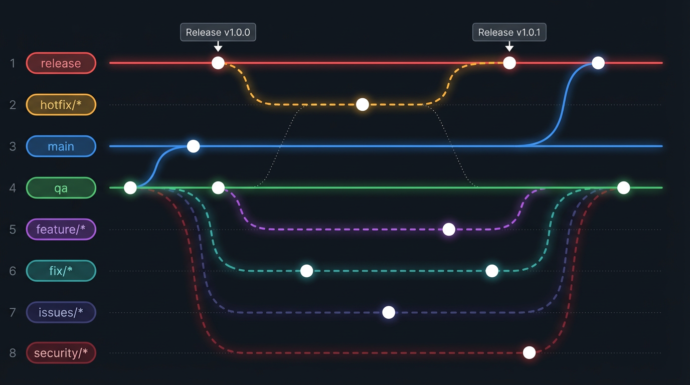

# Ciclo de desarrollo y flujo de ramas (Git)

Guía del equipo para **HarmoniWatts**: mapa de ramas al estilo flujo Git clásico, **origen de cada rama**, **nomenclatura de ramas y commits** (alineada a buenas prácticas de Git y [Conventional Commits](https://www.conventionalcommits.org/)), y uso de **Pull Requests (PR)** con aprobación en **QA**.

---

## 1. Reglas de origen de ramas (obligatorio)

| Qué quieres hacer | Rama que creas | **Desde qué rama partes** | PR / merge hacia |
|-------------------|----------------|---------------------------|------------------|
| Nueva funcionalidad | `feature/*` | **`qa`** | `qa` |
| Bug o error (no urgente en prod) | `fix/*` | **`qa`** | `qa` |
| Problema técnico, deuda o seguridad | `issues/*` | **`qa`** | `qa` |
| **Urgente en producción** | `hotfix/*` | **`release`** (único caso) | `release` → luego retro a `main` y `qa` |

- **`feature/*`**, **`fix/*`** e **`issues/*`** se crean **siempre** a partir de **`qa`** actualizada (`git checkout qa && git pull && git checkout -b feature/...`).
- **`hotfix/*`** es la **única** rama de trabajo que se crea desde **`release`** (código que está o va a producción).

Promoción entre ramas largas:

```text
qa  ──merge (tras validación)──►  main  ──merge (promoción prod)──►  release
```

No se crean features/fix/issues desde `main` ni desde `release` (salvo hotfix).

---

## 2. Mapa de ramas (branching)



*Archivo en esta carpeta:* [`harmoniwatts-git-branching-diagram.png`](imagenes/diagramas/harmoniwatts-git-branching-diagram.png)

**Lectura rápida**

1. Trabajo diario: ramas **`feature/*`**, **`fix/*`**, **`issues/*`** y **`security/*`** (en el diagrama como vía propia) nacen de **`qa`** y vuelven con **PR → `qa`**.
2. Cuando QA está OK: **`qa` → `main`** (pre-producción).
3. Cuando se libera a prod: **`main` → `release`**.
4. **Producción rota**: rama **`hotfix/*`** desde **`release`**, PR a **`release`**, luego llevar el mismo cambio a **`main`** y **`qa`**.

---

## 3. Nomenclatura de ramas (Git)

Convención alineada a lo habitual en Git: **minúsculas**, **kebab-case**, **sin espacios**, prefijo **tipo/ticket-descripcion**.

| Tipo | Patrón | Ejemplo |
|------|--------|---------|
| Feature | `feature/<id-ticket>-<descripcion-corta>` | `feature/hw-42-dashboard-kpis` |
| Fix | `fix/<id-ticket>-<descripcion-corta>` | `fix/hw-88-timeout-login` |
| Issues / seguridad | `issues/<id-ticket>-<descripcion-corta>` | `issues/hw-91-actualizar-openssl` |
| Hotfix | `hotfix/<id-ticket>-<descripcion-corta>` | `hotfix/hw-99-fallo-pago-prod` |

**Comandos de creación (desde `qa`, salvo hotfix):**

```bash
git checkout qa
git pull origin qa
git checkout -b feature/hw-42-dashboard-kpis
```

**Hotfix (solo desde `release`):**

```bash
git checkout release
git pull origin release
git checkout -b hotfix/hw-99-fallo-pago-prod
```

Si no usáis ticket en el nombre, mantened el prefijo y la descripción: `feature/selector-tarifa-tou`.

---

## 4. Nomenclatura de commits (Conventional Commits)

Formato general:

```text
<tipo>(<ámbito opcional>): <descripción breve en minúsculas>
```

- **tipo**: qué clase de cambio es (obligatorio).
- **ámbito**: módulo o zona (opcional, una palabra o `kebab-case` corto).
- **descripción**: imperativo, corta, sin punto final al final (recomendado).

### 4.1. Tipos habituales

| Tipo | Uso | Ejemplo |
|------|-----|---------|
| `feat` | Nueva funcionalidad | `feat(auth): soporte login con google` |
| `fix` | Corrección de bug | `fix(dashboard): corrige escala del eje y` |
| `docs` | Solo documentación | `docs(git): actualiza mapa de ramas` |
| `style` | Formato, comas faltantes; **sin** cambio de lógica | `style(login): aplicar prettier` |
| `refactor` | Refactor sin cambiar comportamiento | `refactor(api): extrae cliente http` |
| `perf` | Mejora de rendimiento | `perf(chart): memoiza cálculo de franjas` |
| `test` | Añadir o corregir tests | `test(kpis): casos para summary dto` |
| `build` | Build, dependencias, tooling | `build(mvn): sube versión plugin` |
| `ci` | CI/CD | `ci: añade job de tests en pr` |
| `chore` | Tareas menores, sin impacto en código de prod | `chore: actualiza .gitignore` |

**Seguridad** (elegid uno y ser consistentes):

- `fix(security): parchea dependencia xss en dependencia y`  
- o `fix(sec): rotación de secreto en pipeline`

### 4.2. Ejemplos alineados a vuestras ramas

| Rama | Ejemplos de commit en esa rama |
|------|--------------------------------|
| `feature/*` | `feat(dashboard): tarjetas kpi consumo y coste` |
| `fix/*` | `fix(login): mensaje de error cuando keycloak cae` |
| `issues/*` | `refactor(security): endurece validación de entrada` |
| `hotfix/*` | `fix(api): null en respuesta de tarifa punta` |

### 4.3. Cuerpo del mensaje y pie (opcional)

Si hace falta contexto:

```text
feat(dashboard): endpoint summary para kpis

- expone consumo del día y coste estimado
- enlaza HW-42

BREAKING CHANGE: campo estimatedCost pasa a entero COP
```

---

## 5. Tabla resumen de ramas

| Rama | Rol | Origen de ramas hijas | Integración |
|------|-----|------------------------|-------------|
| **`release`** | Productiva | **Solo `hotfix/*`** | Merge desde **`main`**; hotfix entra por **PR** y luego se sincroniza hacia `main` y `qa`. |
| **`main`** | Pre-producción | — (no se crean features aquí) | Merge desde **`qa`**. |
| **`qa`** | Pruebas y aprobación de PR | **`feature/*`**, **`fix/*`**, **`issues/*`** | Destino de PRs; base de todo el desarrollo iterativo. |
| **`feature/*`** | Funcionalidad | **`qa`** | PR → `qa`. |
| **`fix/*`** | Bug | **`qa`** | PR → `qa`. |
| **`issues/*`** | Problemas / seguridad | **`qa`** | PR → `qa`. |
| **`hotfix/*`** | Urgente prod | **`release`** | PR → `release` + retro a `main` y `qa`. |

---

## 6. Pull Requests y aprobación

| Destino | Aprobación |
|---------|------------|
| **`qa`** | Aprobadores de PR + check **`CI OK`** en verde (ver [CI.md](CI.md)). |
| **`main`** | Merge controlado tras QA estable (`qa` → `main`). |
| **`release`** | Promoción `main` → `release` o merge urgente de **`hotfix/*`**. |

---

## 7. Hotfix (recordatorio)

1. `git checkout release` → `git pull` → `git checkout -b hotfix/...`
2. Commits con `fix(...):` claros.
3. **PR → `release`** → despliegue.
4. **Retrotraer** a **`main`** y **`qa`** (merge o cherry-pick) para no diverger.

---

## 8. Protección de ramas (recomendado)

- **`release`**, **`main`**, **`qa`**: sin push directo; merges controlados.
- Borrar **`feature/*`**, **`fix/*`**, **`issues/*`**, **`hotfix/*`** tras merge.

---

## 9. Versionado y tags (opcional)

- Tras despliegue desde **`release`**: tag `vMAJOR.MINOR.PATCH`.
- Hotfix en prod: subir **PATCH**.

---

## 10. Resumen ultra corto

```text
Desarrollo normal:  qa  ←── PR ──  feature/* | fix/* | issues/*   (todas creadas desde qa)
Promoción:           qa  ──►  main  ──►  release
Urgente prod:        release  ←── PR ──  hotfix/*   (única rama creada desde release)

Commit:  tipo(ambito): descripcion breve
Ejemplo: feat(dashboard): kpis de consumo y coste
```

---

*Documento vivo. Si el flujo de ramas cambia, actualizad la imagen `harmoniwatts-git-branching-diagram.png` (o sustituidla por una versión corporativa).*
