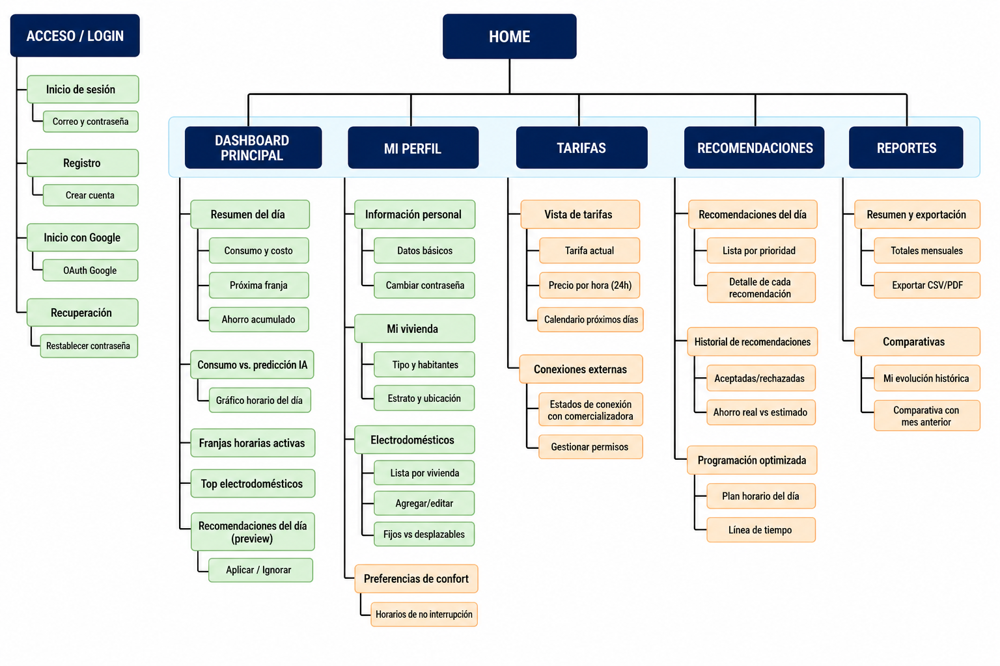
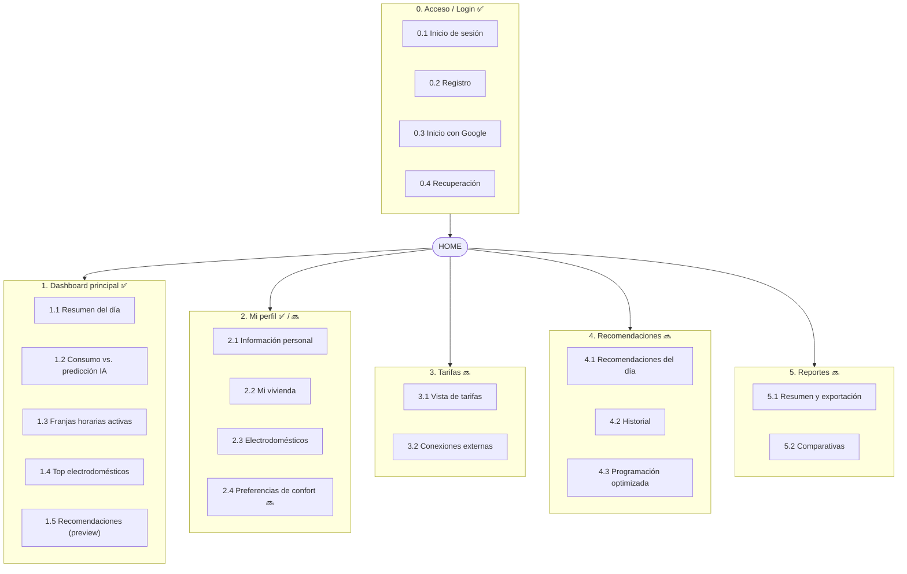
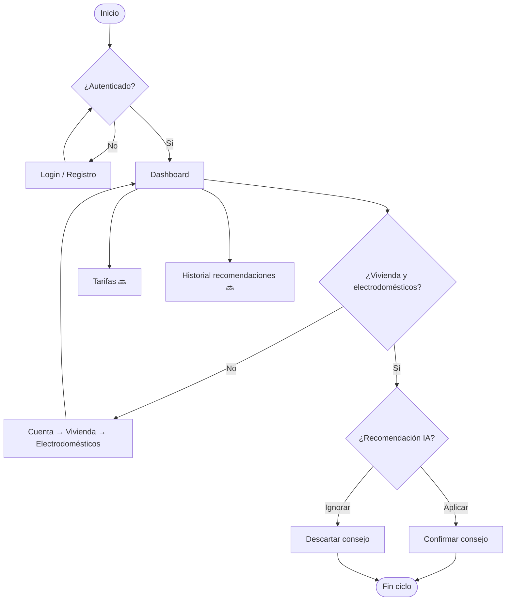

# Tarea: Arquitectura de Información — HarmoniWatts

**Diagramas, descripciones y justificaciones de las decisiones tomadas (parte A)**

| | |
|---|---|
| **Aplicación** | HarmoniWatts — HEMS (Home Energy Management System) para optimizar consumo eléctrico residencial frente a tarifas horarias (TOU) con predicción y recomendaciones IA |
| **Estudiantes** | Christian Camilo Rosero Rodríguez / Carlos David Rojas Lozano |
| **Fecha de entrega** | Mayo 2026 |
| **Profesor** | Javier Mauricio Reyes Vera PhD. |

**Referencias del proyecto:** [HarmoniWatts_BPM.md](HarmoniWatts_BPM.md) · [ARQUITECTURA-HarmoniWatts.md](ARQUITECTURA-HarmoniWatts.md) · [DASHBOARD-API.md](DASHBOARD-API.md)

**Leyenda de estado en el mapa del sitio**

| Símbolo | Significado |
|---------|-------------|
| ✅ | Implementado en el repositorio (Angular + servicios actuales) |
| 🔜 | Planificado en backlog; navegación visible como «próximamente» |
| — | Eliminado del mapa respecto al diseño inicial (decisión de simplificación) |

---

## 1. Descripción de la aplicación

HarmoniWatts es una aplicación web que ayuda a hogares colombianos a **entender su consumo eléctrico**, **anticipar costos** según franjas tarifarias y **actuar sobre recomendaciones de ahorro** generadas por IA. El flujo de negocio principal —modelado en el BPM del proyecto— conecta cinco actores:

1. **Usuario:** crea cuenta, ingresa al sistema y decide si aplica o descarta un consejo de ahorro.
2. **La aplicación:** muestra el panel de consumo y los consejos.
3. **Contador inteligente:** lee y persiste el consumo del hogar.
4. **Tarifas eléctricas:** actualizan automáticamente las franjas del día (CREG / comercializador).
5. **Inteligencia artificial:** predice consumo y calcula el mejor horario para aparatos desplazables.

**Usuario objetivo:** persona residencial con factura regulada por franjas horarias, interesada en reducir costo sin perder confort. No hay rol administrador ni comercializador en la UI actual.

**Alcance de esta arquitectura de información:** refleja lo **ya construido** (auth, dashboard, cuenta/perfil, vivienda, electrodomésticos) y deja módulos futuros **acotados**, evitando duplicar contenido entre pantallas.

---

## 2. Mapa del sitio

### 2.1 Descripción de la estructura

Se adoptó una **estructura jerárquica de dos niveles** (módulo → sección), con separación clara entre **zona pública** (sin autenticación) y **zona privada** (post-login). El criterio organizador de primer nivel es el **flujo del BPM**: acceder → ver panel → consultar tarifas → recibir y decidir sobre recomendaciones → (futuro) revisar reportes.

Respecto al mapa del sitio inicial del proyecto, se aplicaron estos **ajustes**:

| Decisión | Motivo |
|----------|--------|
| Eliminar **Vista de consumo** dentro de *Consumo y tarifas* | El consumo del día (KPIs, gráfico horario, predicción IA y franjas de fondo) ya vive en el **Dashboard**. Duplicarlo aumentaría carga cognitiva y mantenimiento. |
| Eliminar **Simular cambio de tarifa** | Las tarifas se **actualizan automáticamente** según el BPM; la simulación manual no está en alcance del MVP ni en el flujo principal. |
| Acotar **Dashboard** y **Mi perfil (Cuenta)** | Solo se listan secciones con pantalla o API existente en el repositorio. |
| Simplificar Reportes | Se mantienen resumen/exportación y comparativas; sin informes personalizados en MVP |

### 2.1.1 Diagrama del mapa del sitio

*Figura: verde = implementado; naranja = planificado. Sin leyenda en el diagrama; la distinción se explica en la tabla §2.2.*

### 2.2 Tabla detallada del mapa del sitio

| Nivel 1 — Módulo | Nivel 2 — Sección | Nivel 3 — Subsecciones / acciones | Estado | Ruta / notas técnicas |
|------------------|-------------------|-----------------------------------|--------|------------------------|
| **0. Acceso / Login** | 0.1 Inicio de sesión | Correo + contraseña; redirección a dashboard | ✅ | `/auth/login` |
| | 0.2 Registro | Formulario; verificación de correo vía Keycloak | ✅ | `/auth/register` |
| | 0.3 Inicio con Google | OAuth Google vía Keycloak | ✅ | Botón en login |
| | 0.4 Recuperación | Solicitud de enlace por email | ✅ | `/auth/forgot-password` |
| **1. Dashboard principal** | 1.1 Resumen del día | Consumo hoy, costo estimado, ahorro acumulado, próxima franja cara | ✅ | `/dashboard` — API `GET …/summary` |
| | 1.2 Consumo vs. predicción IA | Gráfico horario del día; selector de fecha; franjas como fondo del gráfico | ✅ | Misma ruta — API `GET …/consumption-chart` |
| | 1.3 Franjas horarias activas | Lista de bandas Valle / Media / Punta del día | ✅ | Panel lateral del dashboard |
| | 1.4 Top electrodomésticos | Ranking por participación en consumo del día | ✅ | API `GET …/appliances-top` |
| | 1.5 Recomendaciones (preview) | Tarjetas con ahorro estimado; botones **Aplicar** / **Ignorar** | ✅ | API recomendaciones + POST apply/dismiss |
| **2. Mi perfil** | 2.0 Hub Cuenta | Tarjetas de acceso a subsecciones | ✅ | `/cuenta` |
| | 2.1 Información personal | Datos básicos; cambiar contraseña | ✅ | `/perfil/editar/*` |
| | 2.2 Mi vivienda | Alta, edición y listado de hogares | ✅ | `/mi-vivienda` |
| | 2.3 Electrodomésticos | CRUD por vivienda; fijos vs desplazables | ✅ | `/cuenta/electrodomesticos` |
| | 2.4 Preferencias de confort | Horarios de no interrupción | 🔜 | Visible en hub como «próximamente» |
| **3. Tarifas** | 3.1 Vista de tarifas | Tarifa actual, gráfico 24 h, calendario próximos días | 🔜 | Ítem lateral deshabilitado |
| | 3.2 Conexiones externas | Estado de conexión con comercializadora; gestionar permisos | 🔜 | Integración futura |
| | ~~Vista de consumo~~ | — | — | **Eliminado** — ver módulo 1 |
| | ~~Simular cambio de tarifa~~ | — | — | **Eliminado** — tarifas automáticas |
| **4. Recomendaciones** | 4.1 Recomendaciones del día | Lista por prioridad; detalle de cada recomendación | 🔜 | Módulo completo (preview en 1.5) |
| | 4.2 Historial de recomendaciones | Decisiones pasadas, ahorro real vs. estimado | 🔜 | Complementa dashboard |
| | 4.3 Programación optimizada | Línea de tiempo del plan diario de aparatos | 🔜 | Corresponde a «Calcula mejor horario» en BPM |
| **5. Reportes** | 5.1 Resumen y exportación | Totales mensuales; export CSV/PDF por rango | 🔜 | Módulo futuro |
| | 5.2 Comparativas | Mi evolución histórica; comparativa con mes anterior | 🔜 | Análisis longitudinal |

### 2.3 Justificación del mapa del sitio

**Dashboard como hub operativo único de consumo.** El BPM indica que, tras guardar datos del contador, la aplicación «muestra el panel de consumo». Concentrar KPIs, serie horaria, franjas y ranking de aparatos en un solo módulo reduce saltos de navegación en el uso diario (patrón repetitivo: abrir app → revisar día → decidir sobre un consejo). Por eso se eliminó la *Vista de consumo* del módulo de tarifas.

**Módulo Tarifas enfocado en precio, no en kWh.** Separar *precio* (consulta tarifaria) de *consumo* (medición) respeta la responsabilidad del carril «Tarifas eléctricas» en el BPM. El usuario consulta cuánto cuesta cada franja; el consumo ya se interpreta en el dashboard con superposición de bandas tarifarias en el gráfico.

**Cuenta como agrupador de configuración del hogar.** Registro de vivienda y electrodomésticos corresponde al paso BPM «Crear cuenta y registrar electrodomésticos» en primer uso. Agruparlos bajo *Cuenta* evita un menú principal saturado y mantiene el sidebar con cinco ítems de trabajo frecuente (Dashboard, Tarifas, Recomendaciones, Historial, Ajustes — los tres últimos aún deshabilitados en UI).

**Eliminación de simulación de tarifa.** Contradice el flujo automático del BPM («Se actualizan automáticamente») y no aporta valor en el MVP donde la fuente tarifaria es externa y de solo lectura.

**Correspondencia BPM ↔ mapa del sitio**

| Paso BPM | Ubicación en el mapa |
|----------|----------------------|
| Crear cuenta / ingresar | Módulo 0 |
| Registrar electrodomésticos | 2.3 (post-registro vía 2.2 si no hay vivienda) |
| Panel de consumo | Módulo 1 completo |
| Tarifas del día | 1.3 + 1.1 (franja actual) + módulo 3 🔜 |
| Predicción IA | 1.2 |
| Consejos para ahorrar | 1.5 (+ módulo 4 🔜 para historial) |
| ¿Aplica el consejo? | 1.5 Aplicar / Ignorar |
| Guarda la decisión | Backend (consumption-service) — reflejado en historial 🔜 |

---

## 3. Taxonomías y metadatos

### 3.1 Taxonomía de franjas tarifarias (TOU)

Clasificación **jerárquica exclusiva** por intervalo horario del día. Cada hora pertenece a una sola franja.

| Nivel | Categorías | Ejemplo |
|-------|------------|---------|
| Tipo de franja | `VALLE`, `MEDIA`, `PUNTA` | 22:00–06:00 → VALLE |
| Precio | Numérico (COP/kWh) | 245 COP/kWh en VALLE |
| Ventana temporal | `startHour`, `endHour` (0–23) | PUNTA 18:00–22:00 |

**Justificación:** Una hora no puede ser Valle y Punta a la vez; clasificación exclusiva simplifica colores en gráfico y KPI «Próxima franja». Implementado en `TariffBand` / `TariffType` del frontend y contrato `DASHBOARD-API.md`.

### 3.2 Taxonomía de electrodomésticos

Taxonomía **polijerárquica** en tipos predefinidos + atributos transversales.

| Dimensión | Valores / regla | Ejemplo |
|-----------|-----------------|---------|
| Tipo predefinido | Catálogo BD (`electrodomestico_tipo_predefinido`) + código `OTRO` | Lavadora, nevera, «Otro» con nombre libre |
| Marca | Catálogo + `OTRO` con texto libre | Samsung / «Otro: Mabe» |
| Desplazabilidad | Booleano `es_desplazable` | Lavadora = desplazable; nevera = fija |
| Categoría visual (UI) | Derivada del tipo para iconografía | `heat`, `washer`, `hvac`, `fridge`, `default` |

**Justificación:** Un mismo aparato se filtra por **tipo** (para IA y ranking), por **desplazabilidad** (para optimización de horarios BPM) y por **vivienda** (contexto multi-hogar). La polijerarquía en tipo + desplazable permite consultas como «todos los desplazables de esta vivienda» sin duplicar registros.

### 3.3 Taxonomía de vivienda

| Campo | Tipo | Valores |
|-------|------|---------|
| `tipo` | Enum UI | Casa, Apartamento, Otro (según formulario actual) |
| `estrato` | Entero 1–6 | Estrato socioeconómico Colombia |
| `habitantes` | Entero | 1–99 |
| `ubicacion` | Texto | Dirección o referencia |

### 3.4 Metadatos principales

#### Consumo (serie horaria — contador / mock)

| Campo | Tipo | Descripción | Uso |
|-------|------|-------------|-----|
| `date` | ISO date | Día de la medición | Filtro dashboard |
| `timezone` | String | Zona horaria del hogar | Eje temporal |
| `actualKwh` | Array numérico | Consumo real por hora | Gráfico + KPIs |
| `predictedKwh` | Array numérico \| null | Predicción IA | Línea punteada en gráfico |
| `currentHourLocal` | Entero | Hora «ahora» | Marcador vertical |
| `tariffBands` | Array | Franjas del día | Fondo del gráfico y panel lateral |

#### Recomendación IA

| Campo | Tipo | Descripción | Uso |
|-------|------|-------------|-----|
| `id` | UUID / string | Identificador | Apply / dismiss |
| `title`, `body` | String | Mensaje al usuario | Tarjeta en dashboard |
| `estimatedSavingsCop` | Numérico | Ahorro estimado | Decisión del usuario |
| `suggestedStart` | DateTime opcional | Horario sugerido | Programación 🔜 |
| `priority` | Entero opcional | Orden de visualización | Top N en dashboard |

#### Electrodoméstico (persistencia PostgreSQL)

| Campo | Tipo | Descripción | Uso |
|-------|------|-------------|-----|
| `consumo_kwh_dia` | Numérico | Consumo promedio diario (kWh) | Dashboard / cargas |
| `uso_semanal` | Entero | Veces por semana | Perfil de uso |
| `horario_habitual` | Time | Hora típica de uso | IA / recomendaciones |
| `es_desplazable` | Boolean | ¿Puede moverse de franja? | Optimizador BPM |
| `activo` | Boolean | Incluir en análisis | CRUD |

**Justificación del metadato `es_desplazable`:** Enlaza directamente con el carril IA del BPM («Calcula el mejor horario para tus aparatos»). Sin este flag, el optimizador trataría igual una nevera y una lavadora, generando recomendaciones no accionables.

**Justificación de `predictedKwh` nullable:** Si el predictor no responde, el dashboard sigue mostrando consumo real (`predictionUnavailable` en UI). Evita bloquear el panel ante fallos parciales — coherente con arquitectura hexagonal y degradación graceful.

---

## 4. Navegabilidad

### 4.1 Sistema de navegación principal

| Sistema | Descripción | Ubicación | Módulos |
|---------|-------------|-----------|---------|
| **Barra lateral fija** | Navegación primaria post-login; icono + etiqueta | Columna izquierda (`dash-shell`) | Dashboard ✅; Tarifas, Recomendaciones, Historial, Ajustes 🔜 |
| **Hub de tarjetas** | Navegación secundaria en Cuenta | `/cuenta` | Perfil, vivienda, electrodomésticos |
| **Enlaces contextuales** | Saltos guiados por flujo de datos | Cuerpo de pantallas | Ej.: electrodomésticos → «Registra una vivienda» si lista vacía |
| **Breadcrumbs implícitos** | Botón «Volver a Cuenta» | Electrodomésticos | `/cuenta/electrodomesticos` → `/cuenta` |

**Justificación:** Sidebar con pocos ítems permanentes sigue el patrón del ejemplo NutriAI (Tab Bar / acceso en un toque). En HarmoniWatts el **Dashboard** es el destino por defecto (`'' → dashboard`) porque es la pantalla de mayor frecuencia tras login, alineada al BPM (panel de consumo inmediato).

### 4.2 Flujo de navegación principal

| # | Pantalla / acción | Decisión | Destino |
|---|-------------------|----------|---------|
| 1 | Usuario abre la app | ¿Sesión Keycloak activa? | Sí → Dashboard (4) / No → Login (2) |
| 2 | Login | ¿Credenciales válidas? | Sí → Dashboard / No → error |
| 3 | Registro | ¿Correo verificado? | Sí → Login → Dashboard |
| 4 | Dashboard | — | Revisión KPIs, gráfico, recomendaciones |
| 5 | ¿Primera vez sin vivienda? | ¿Hay vivienda registrada? | No → Cuenta → Mi vivienda (6) |
| 6 | Mi vivienda + electrodomésticos | Datos mínimos para IA | Vuelta a Dashboard |
| 7 | Recomendación en dashboard | ¿Aplica el consejo? | Sí → POST apply / No → POST dismiss |
| 8 | Fin del ciclo diario | — | Usuario permanece en dashboard o explora Tarifas 🔜 |

**Justificación del flujo post-registro:** El BPM exige «registrar electrodomésticos» en primer uso, pero no bloquea el login. El dashboard puede cargarse con datos parciales; la UI de electrodomésticos enlaza a vivienda si falta contexto. Equilibrio entre **onboarding progresivo** y **valor temprano** (ver consumo aunque el inventario esté incompleto).

---

## 5. Mecanismos de búsqueda

HarmoniWatts no es un catálogo masivo; la búsqueda es **contextual y acotada** a listas que el usuario gestiona.

| Mecanismo | Descripción | Módulo | Método |
|-----------|-------------|--------|--------|
| **Selector de vivienda** | Filtra electrodomésticos por hogar | 2.3 Electrodomésticos | `<select>` sobre lista `GET /viviendas` |
| **Selector de fecha** | Cambia el día del dashboard | 1. Dashboard | `<input type="date">` + query `date=` en API |
| **Catálogo desplegable (tipo/marca)** | Elige ítem de taxonomía predefinida | 2.3 | Select con catálogos backend |
| **Actualizar / recargar** | Refetch explícito de datos | Dashboard, listas | Botón «Actualizar» |
| **Búsqueda por texto libre** 🔜 | Filtrar historial de recomendaciones o reportes | 4, 5 | Input con filtro client-side o query API |

### 5.1 Reglas del selector de fecha (dashboard)

1. Por defecto: fecha local del navegador.
2. Al cambiar fecha: recarga paralela de summary, chart, recommendations y appliances-top.
3. Fechas futuras: según reglas del API (422 si no aplicable).

**Justificación:** La «búsqueda» principal del usuario es temporal («¿cómo estuvo ayer?»), no lexical. Priorizar selector de fecha sobre un buscador global reduce ruido en un HEMS donde el volumen de entidades por usuario es bajo (pocas viviendas, decenas de electrodomésticos como máximo).

### 5.2 Búsqueda en catálogo de electrodomésticos (comportamiento actual)

1. Tipos y marcas se cargan ordenados (`orden` ASC) desde PostgreSQL.
2. Si tipo = `OTRO`, el campo nombre es obligatorio (validación cliente y servidor).
3. No hay autocompletado full-text en MVP; la lista es corta y escaneable.

**Justificación:** Catálogo cerrado y curado para Colombia; autocompletado semántico queda para la función 🔜 «Rellenar con IA (foto)» ya visible como acción futura en la UI.

---

## 6. Resumen de decisiones de arquitectura de información

| Decisión tomada | Alternativa descartada | Criterio | Validación |
|-----------------|------------------------|----------|------------|
| Consumo solo en Dashboard | Duplicar «Vista de consumo» en Tarifas | Un solo hub operativo; BPM centra panel de consumo | Revisión contra BPM + código actual |
| Tarifas sin simulador | Simular cambio de tarifa | Tarifas automáticas externas | BPM carril «Tarifas eléctricas» |
| Cuenta agrupa perfil + hogar | Mi perfil como raíz con 4 ramas planas | Sidebar simple; configuración es esporádica | Estructura `app.routes.ts` |
| Recomendaciones duales: preview + historial | Solo módulo Recomendaciones | Decisión rápida en dashboard; profundidad en módulo 🔜 | Flujo BPM «¿Aplica el consejo?» |
| Taxonomía TOU exclusiva | Etiquetas múltiples por hora | Modelo regulatorio CREG | `TariffBand` en API |
| Flag `es_desplazable` | Inferir solo por tipo | Optimización IA accionable | Entidad `Electrodomestico` |
| Reportes en un solo módulo | Tres submódulos (mensual, personalizado, comparativas) | MVP más simple de implementar | Alcance sprint actual |
| Sidebar 5 ítems | Menú hamburguesa | Acceso frecuente a dashboard | Patrón mockup + `dash-shell` |

---

## 7. Notas para la presentación (10–15 min)

1. **Contexto (2 min):** Problema HEMS, actores del BPM, usuario residencial.
2. **Mapa del sitio (4 min):** Mostrar diagrama; explicar eliminaciones (consumo duplicado, simulador) y qué está ✅ vs 🔜.
3. **Taxonomías (3 min):** Franjas TOU, electrodomésticos desplazables, metadatos clave para IA.
4. **Navegabilidad (3 min):** Sidebar + flujo primer uso + decisión sobre recomendaciones.
5. **Búsqueda (2 min):** Fecha y selectores vs buscador global.
6. **Cierre (1 min):** Tabla de decisiones y próximos pasos (Tarifas, historial recomendaciones, reportes).

---

*Documento alineado al estado del repositorio HarmoniWatts (mayo 2026). Actualizar cuando se habiliten ítems 🔜 del sidebar.*
