# Proceso HarmoniWatts — BPM
**Notacion:** BPMN 2.0 · Sprint 0 · HU-03

> El diagrama con swimlanes horizontales y colores esta en el archivo **`HarmoniWatts_BPM.drawio`**  
> Abrilo en [draw.io](https://app.diagrams.net) → Archivo → Abrir desde → Este dispositivo

---

## Flujo resumido

```mermaid
flowchart LR
    classDef u fill:#FFF9C4,stroke:#F9A825,color:#333
    classDef a fill:#BBDEFB,stroke:#1565C0,color:#333
    classDef x fill:#C8E6C9,stroke:#2E7D32,color:#333
    classDef i fill:#E1BEE7,stroke:#6A1B9A,color:#333
    classDef s fill:#4CAF50,stroke:#2E7D32,color:#fff
    classDef e fill:#F44336,stroke:#B71C1C,color:#fff
    classDef g fill:#fff,stroke:#888,color:#333

    ST([Inicio]):::s
    B{Primera vez?}:::g
    C[Crear cuenta]:::u
    D[Ingresar al sistema]:::u
    E[Lee consumo del hogar]:::a
    F[Guarda en la nube]:::a
    L[Tarifas del dia]:::x
    M[Predice consumo]:::i
    N[Calcula mejor horario]:::i
    G[Panel de consumo]:::a
    P[Consejos para ahorrar]:::a
    Q{Aplica el consejo?}:::g
    RA[Confirma]:::u
    RI[Descarta]:::u
    FN([Fin]):::e

    ST --> B
    B -- Si --> C --> D
    B -- No --> D
    D --> E --> F
    F --> G
    F --> L --> M
    M --> G
    M --> N --> P
    P --> Q
    Q -- Si --> RA --> FN
    Q -- No --> RI --> FN
```

---

### Carriles del proceso

| Carril | Quien actua |
|--------|-------------|
| 👤 Usuario | Crea cuenta, ingresa al sistema, decide si aplica el consejo |
| 📱 La aplicacion | Muestra el panel de consumo y los consejos de ahorro |
| 🔌 Contador inteligente | Lee y guarda los datos de consumo del hogar |
| 💡 Tarifas electricas | Recibe y actualiza las tarifas del dia (CREG / EPM / Enel) |
| 🧠 Inteligencia Artificial | Predice el consumo y calcula el mejor horario para los aparatos |
