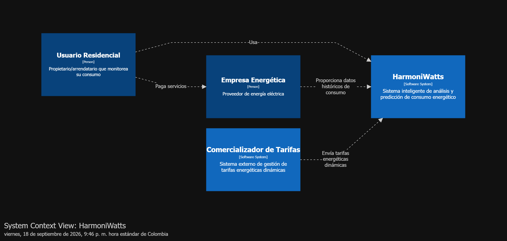
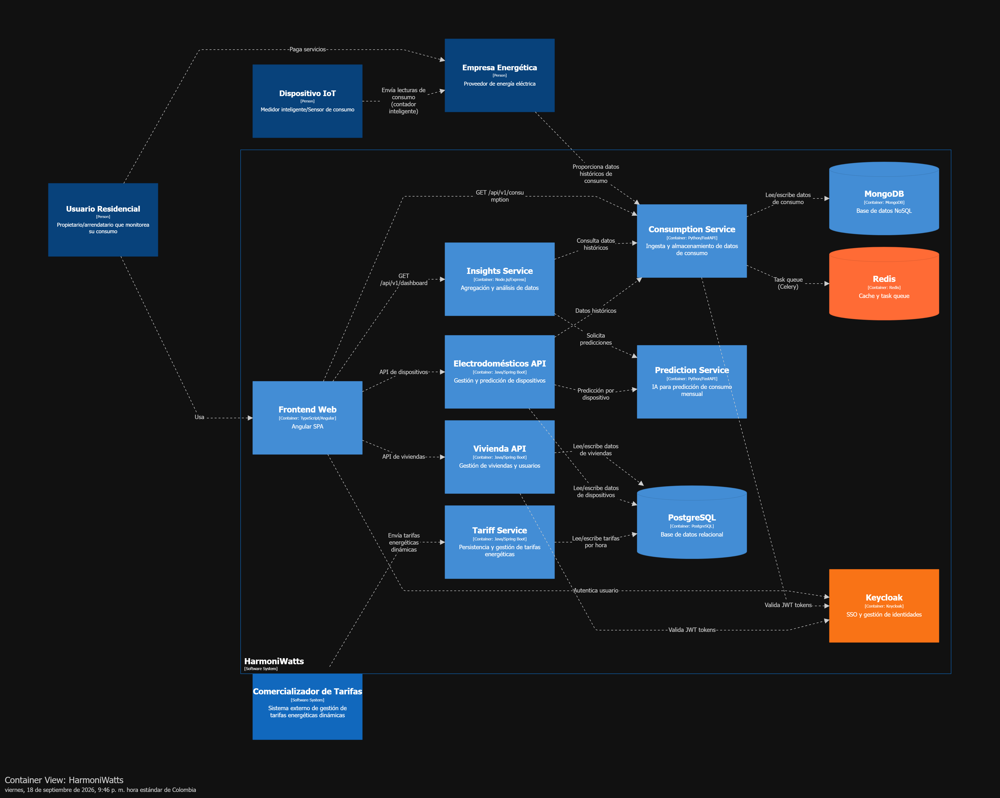
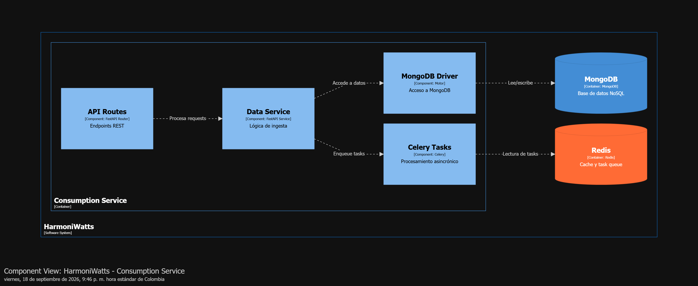
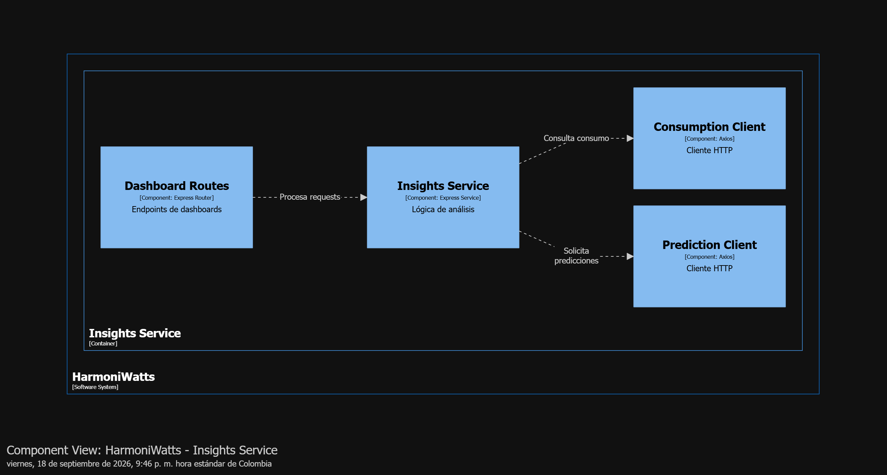
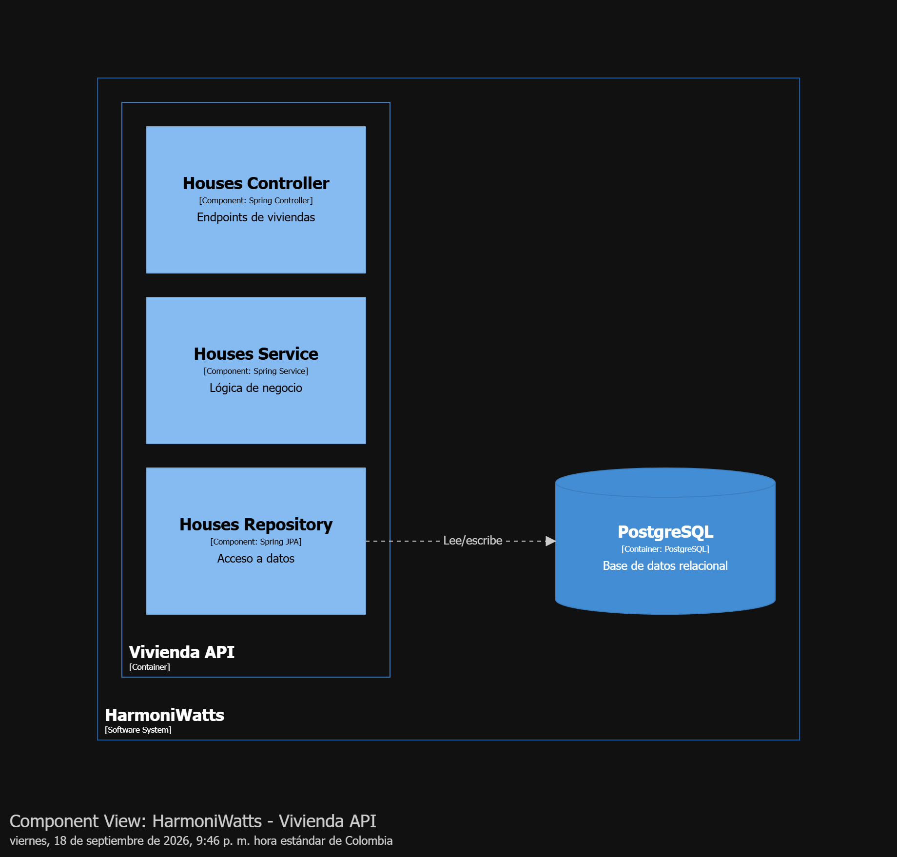
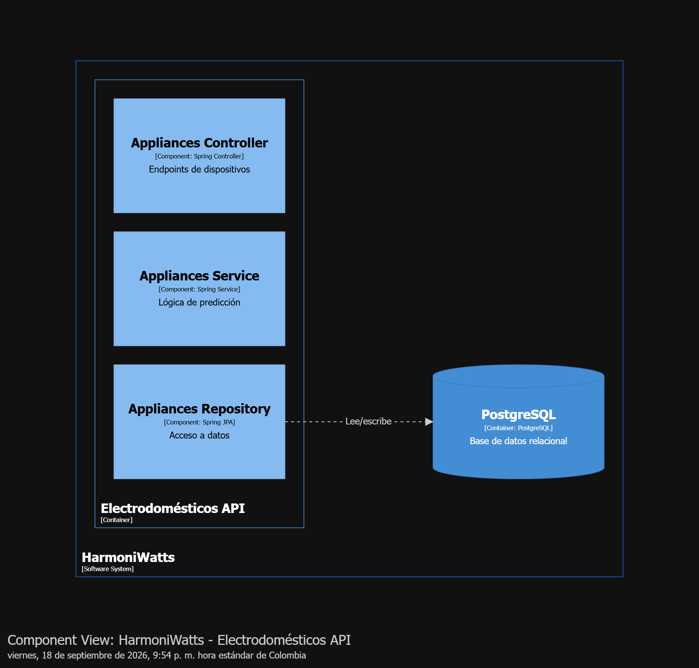
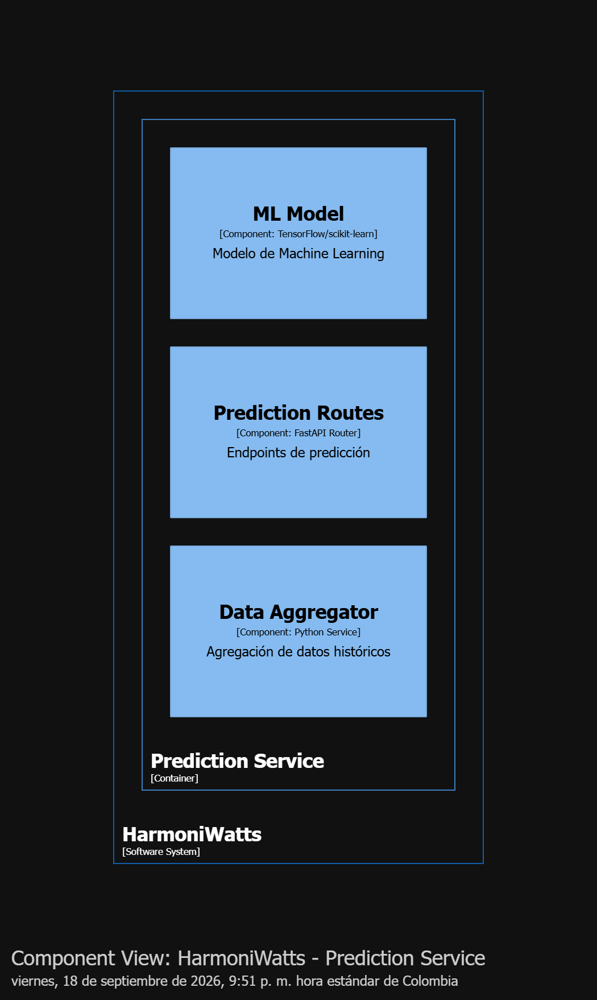

# 📊 Diagramas C4 - HarmoniWatts

**Diagramas de arquitectura compilados desde Structurizr DSL como imágenes PNG + diagrama de secuencia.**

---

## 📋 Índice de Diagramas

| Diagrama | Ubicación | Descripción |
|----------|-----------|-------------|
| **System Context** | `images/c4-context.png` | Nivel 1: Usuario, Sistema, Actores externos |
| **Container Architecture** | `images/c4-container.png` | Nivel 2: 10 contenedores principales |
| **Consumption Service Components** | `images/c4-component-consumption.png` | Level 3: Detalles internos |
| **Insights Service Components** | `images/c4-component-insights.png` | Level 3: Detalles internos |
| **Vivienda API Components** | `images/c4-component-vivienda.png` | Level 3: Detalles internos |
| **Electrodomésticos API Components** | `images/c4-component-appliances.png` | Level 3: Detalles internos |
| **Prediction Service Components** | `images/c4-component-prediction.png` | Level 3: Detalles internos |

---

## Level 1: System Context



**Descripción:**
- **Usuario Residencial:** Propietario/arrendatario que monitorea su consumo
- **Empresa Energética:** Proveedor de tarifas y datos históricos
- **Dispositivo IoT:** Medidor inteligente que envía lecturas en tiempo real
- **HarmoniWatts:** Sistema centralizado de análisis y predicción

---

## Level 2: Container Architecture



**Contenedores principales:**

### 📱 Frontend
- **Frontend Web** (Angular SPA) - Dashboard interactivo

### 🔵 Microservicios Backend

**Consumption Service (Python/FastAPI)**
- Ingesta de datos IoT en tiempo real
- Almacenamiento en MongoDB
- Procesamiento asincrónico con Celery

**Insights Service (Node.js/Express)**
- Agregación y análisis de datos
- Generación de dashboards
- Consulta de predicciones

**Vivienda API (Java/Spring Boot)**
- Gestión de viviendas y usuarios
- Configuración residencial
- Autenticación con Keycloak

**Electrodomésticos API (Java/Spring Boot)**
- Registro de dispositivos
- Predicción por aparato individual
- Recomendaciones de reemplazo

**Prediction Service (Python/FastAPI + ML)** ⏳ Planeado
- Modelo de Machine Learning
- Predicción de consumo mensual
- API REST para consultas

**Tariff Service (Java/Spring Boot)** 🔄 Mockado
- Gestión de tarifas energéticas dinámicas
- Integración con proveedores

### 🔐 Autenticación
- **Keycloak** - SSO, OIDC/OAuth2, gestión de identidades

### 🗄️ Infraestructura
- **MongoDB** - Series de tiempo (consumption_readings, daily_summaries)
- **PostgreSQL** - Datos transaccionales (users, households, appliances)
- **Redis** - Cache + Celery task queue

---

## Level 3: Component Diagrams

### 🔵 Consumption Service - Componentes Internos



**Componentes:**
- **API Routes:** Endpoints REST (`/ingest`, `/api/v1/consumption/*`)
- **Data Service:** Lógica de validación y transformación
- **MongoDB Driver:** Acceso asincrónico a MongoDB con Motor
- **Celery Tasks:** Procesamiento asincrónico de ingesta masiva

### 🟢 Insights Service - Componentes Internos



**Componentes:**
- **Dashboard Routes:** Endpoints `/api/v1/dashboard/*`
- **Insights Service:** Lógica de agregación y análisis
- **Consumption Client:** Cliente HTTP para Consumption Service
- **Prediction Client:** Cliente HTTP para Prediction Service

### 🟡 Vivienda API - Componentes Internos



**Componentes:**
- **Houses Controller:** Endpoints REST para CRUD de viviendas
- **Houses Service:** Lógica de negocio y validaciones
- **Houses Repository:** Acceso a datos con Spring JPA
- PostgreSQL backend

### 🟠 Electrodomésticos API - Componentes Internos



**Componentes:**
- **Appliances Controller:** Endpoints REST para dispositivos
- **Appliances Service:** Clasificación y cálculo de consumo
- **Appliances Repository:** Acceso a datos con Spring JPA
- Llamadas a Prediction Service
- PostgreSQL backend

### 🟣 Prediction Service - Componentes Internos (Planeado)



**Componentes:**
- **Prediction Routes:** Endpoints `/predict/monthly`, `/predict/appliance`
- **ML Model:** Modelo entrenado (TensorFlow/scikit-learn)
- **Data Aggregator:** Obtiene datos históricos de Consumption Service

---

## 🔄 Diagramas de Secuencia

Los diagramas de secuencia se encuentran en:
- **Archivo Mermaid:** [`docs/architecture/sequence-diagrams.mmd`](sequence-diagrams.mmd)
- **Descripción:** 6 flujos principales del sistema
  - Ingesta de datos en tiempo real
  - Visualización de dashboards
  - Predicción de electrodomésticos
  - Autenticación con Keycloak
  - Recomendaciones de ahorro (futuro)
  - Integración con proveedor de energía (futuro)

---

## 📥 Compilar Diagramas Interactivos (Structurizr)

Si deseas modificar o explorar interactivamente los diagramas C4:

### Opción 1: Online (Recomendado - Sin instalación)
```
1. Ir a https://structurizr.com/dsl
2. Copiar contenido de docs/architecture/workspace.dsl
3. Pegar en el editor (lado izquierdo)
4. Los diagramas se renderizan automáticamente (lado derecho)
5. Exportar como PNG/SVG desde el menú
```

### Opción 2: Docker Local
```bash
docker run -it --rm -p 8080:8080 -v ./docs/architecture:/workspace structurizr/lite:latest
# Luego abrir http://localhost:8080
```

---

## 📋 Leyenda de Colores

| Color | Significado |
|-------|------------|
| 🔵 Azul | Microservicios principales |
| 🟢 Verde | Servicios de análisis e insights |
| 🟡 Amarillo | APIs de dominio |
| 🟠 Naranja | APIs especializadas |
| 🟣 Púrpura | Servicios de predicción (planeados) |
| 🗄️ Gris | Bases de datos |
| 🔴 Rojo | Cache y queues |
| 🔐 Naranja | Identidad y autenticación |

---

## 📚 Referencias

- **Documento Maestro:** `docs/ARQUITECTURA-MAESTRA.md`
- **Diccionario de Datos:** `docs/architecture/DATA_DICTIONARY.md`
- **Diagramas de Secuencia:** `docs/architecture/sequence-diagrams.mmd`
- **Archivo DSL:** `docs/architecture/workspace.dsl` (para compilación online)
- **C4 Model:** https://c4model.com/
- **Structurizr:** https://structurizr.com/

---

**Última actualización:** 18 de Septiembre de 2026  
**Estado:** Diagramas compilados como PNG  
**Sincronización:** Imágenes disponibles en GitHub y Confluence
