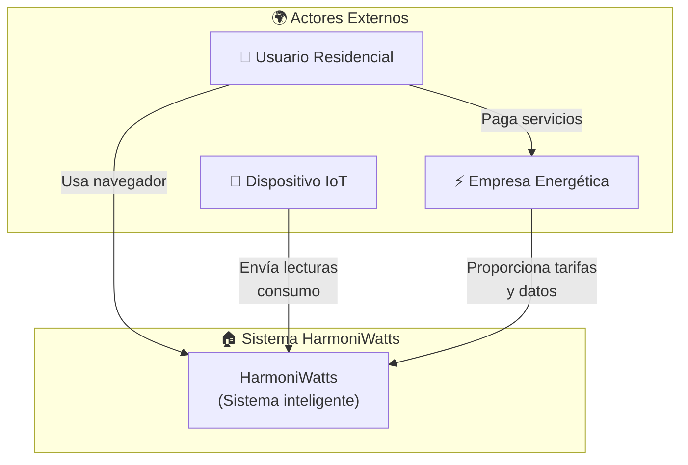
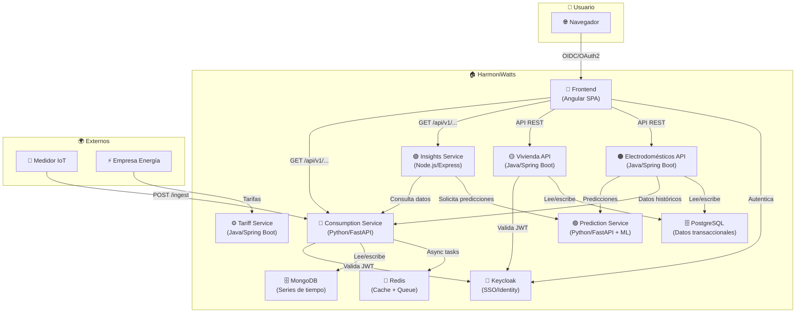
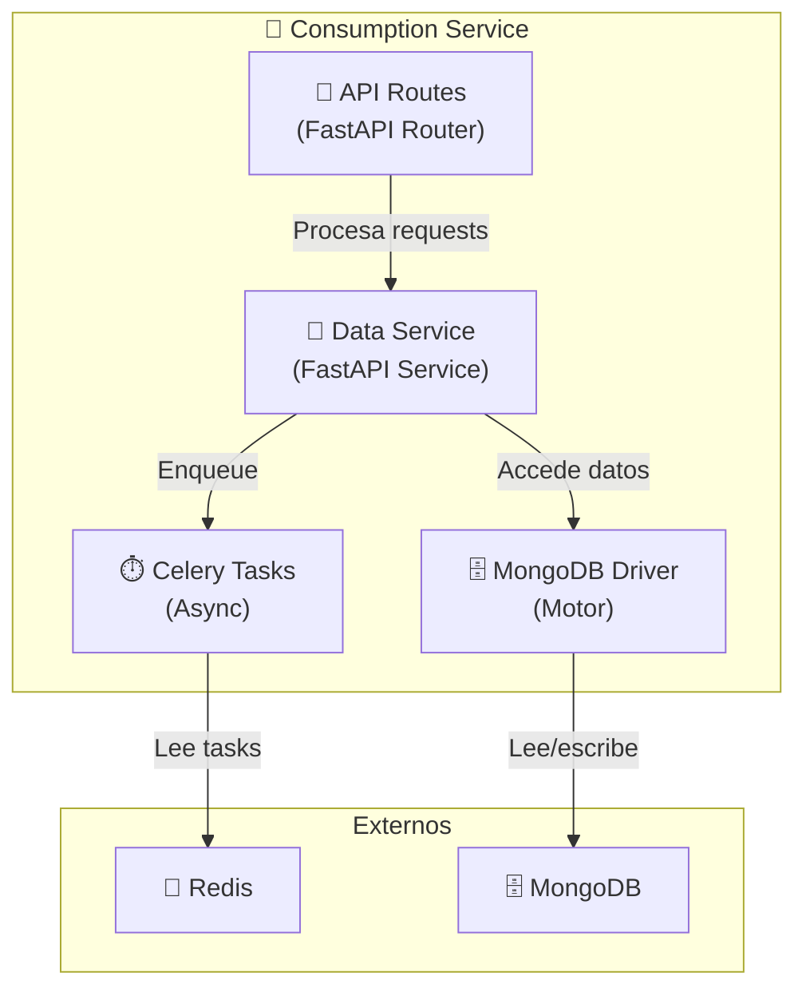
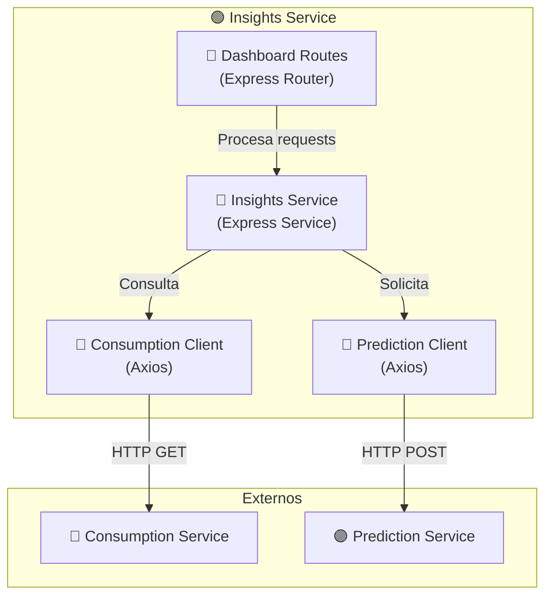
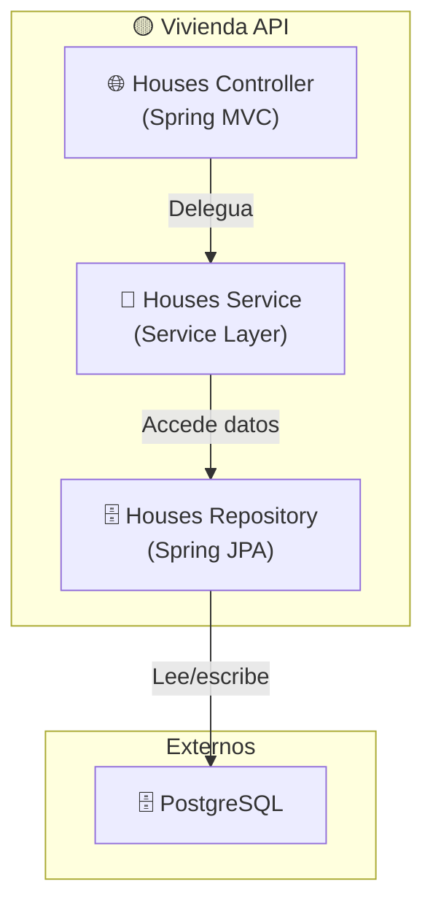
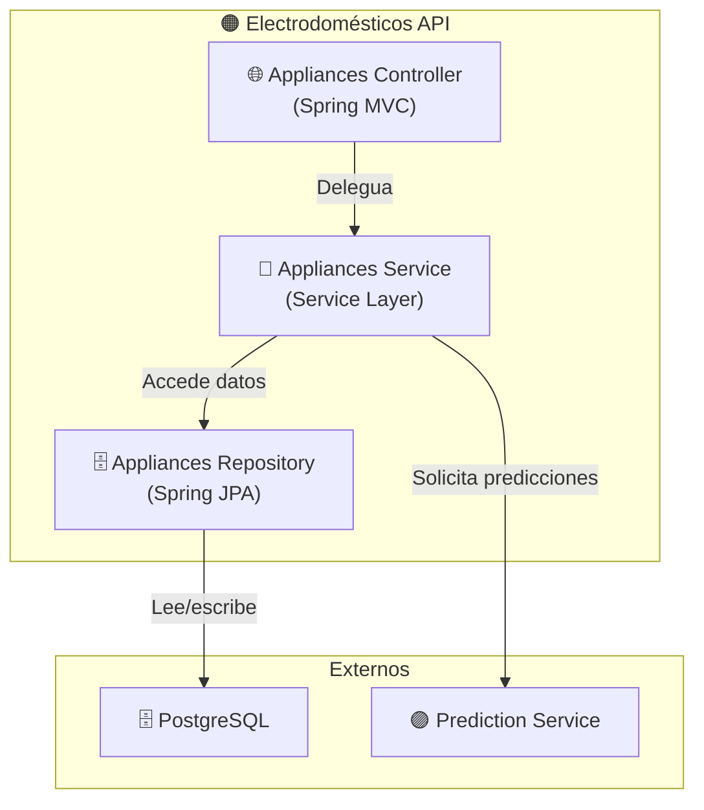
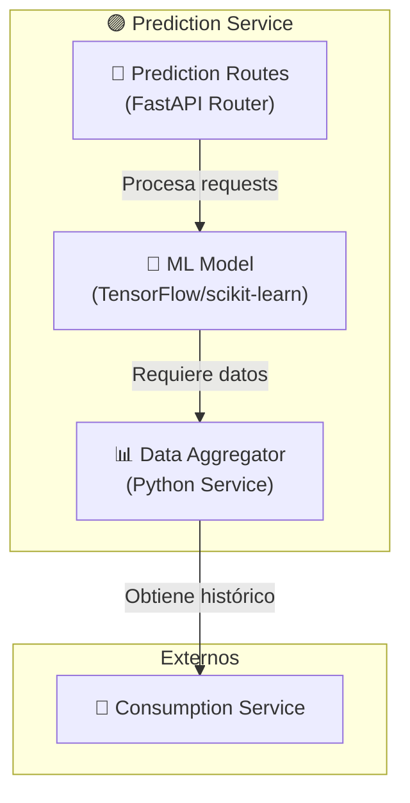
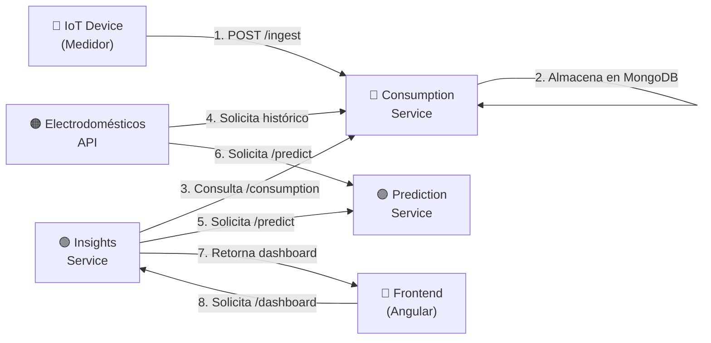
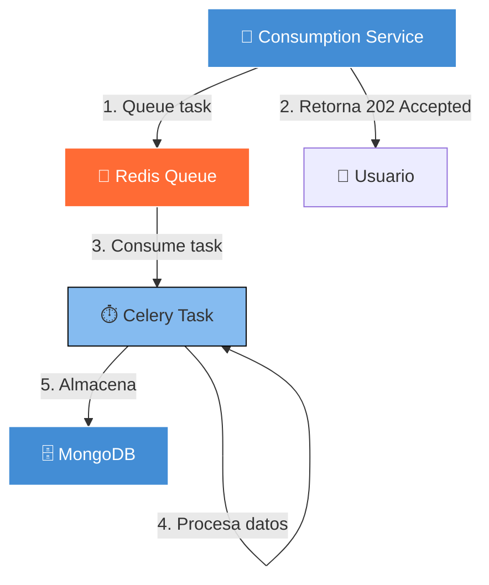

# 📊 Diagramas C4 - HarmoniWatts

**Diagramas de arquitectura compilados desde Structurizr DSL con visualización completa.**

---

## 🔧 Compilar Diagramas Interactivos

Para obtener diagramas interactivos y explorables:

### Opción 1: Online (Recomendado - Sin instalación)
```
1. Ir a https://structurizr.com/dsl
2. Copiar contenido de docs/architecture/workspace.dsl
3. Pegar en el editor (lado izquierdo)
4. Los diagramas se renderizan automáticamente (lado derecho)
5. Puedes hacer zoom, arrastrar, exportar como PNG/SVG
```

### Opción 2: Docker Local
```bash
docker run -it --rm -p 8080:8080 -v ./docs/architecture:/workspace structurizr/lite:latest
# Luego abrir http://localhost:8080
```

---

## Level 1: System Context - C4

**¿Qué es?** Visión de alto nivel del sistema y sus actores externos.



**Componentes:**
- **Usuario Residencial:** Propietario/arrendatario que interactúa con el sistema
- **Empresa Energética:** Proveedor de tarifas, datos de consumo histórico
- **Dispositivo IoT:** Medidor inteligente que envía datos de consumo en tiempo real
- **HarmoniWatts:** Sistema centralizado que orquesta todo

---

## Level 2: Container Architecture - C4

**¿Qué es?** Principales contenedores (aplicaciones, servicios, BDs) que componen el sistema.



**Contenedores principales:**

| Contenedor | Tech | Responsabilidad |
|-----------|------|-----------------|
| **Frontend Web** | Angular 21+ | SPA responsivo, dashboards, controles |
| **Consumption Service** | Python/FastAPI | Ingesta IoT, almacenamiento, query consumo |
| **Insights Service** | Node.js/Express | Agregación datos, dashboards, análisis |
| **Vivienda API** | Java/Spring Boot | Gestión viviendas, usuarios, perfiles |
| **Electrodomésticos API** | Java/Spring Boot | Registro dispositivos, predicciones |
| **Prediction Service** | Python/FastAPI + ML | IA para predicción de consumo (⏳ Planeado) |
| **Tariff Service** | Java/Spring Boot | Gestión tarifas energéticas (🔄 Mockado) |
| **Keycloak** | Keycloak | SSO, OIDC/OAuth2, gestión identidades |
| **MongoDB** | NoSQL | Series de tiempo, consumo real-time |
| **PostgreSQL** | SQL Relacional | Datos transaccionales (usuarios, dispositivos) |
| **Redis** | Cache/Queue | Cache, Celery tasks |

---

## Level 3: Component Diagrams - C4

### Consumption Service - Componentes



**Responsabilidades:**
- **API Routes:** Endpoints REST (`/ingest`, `/api/v1/consumption/*`)
- **Data Service:** Lógica de validación, transformación, procesamiento
- **MongoDB Driver:** Acceso asincrónico a MongoDB
- **Celery Tasks:** Procesamiento asincrónico de ingesta masiva

### Insights Service - Componentes



**Responsabilidades:**
- **Dashboard Routes:** Endpoints `/api/v1/dashboard/*`, `/api/v1/recommendations/*`
- **Insights Service:** Agregación, análisis, lógica de negocio
- **Clients:** Clientes HTTP para consultar otros servicios

### Vivienda API - Componentes



**Responsabilidades:**
- **Controller:** Endpoints REST para CRUD de viviendas
- **Service:** Lógica de negocio, validaciones
- **Repository:** Persistencia en PostgreSQL

### Electrodomésticos API - Componentes



**Responsabilidades:**
- **Controller:** Endpoints REST para dispositivos, predicciones
- **Service:** Clasificación, cálculo de consumo estimado
- **Repository:** Persistencia en PostgreSQL

### Prediction Service - Componentes (Planeado)



**Responsabilidades:**
- **Prediction Routes:** Endpoints `/predict/monthly`, `/predict/appliance`
- **ML Model:** Modelo entrenado (TensorFlow/scikit-learn)
- **Data Aggregator:** Obtiene datos históricos y los prepara para ML

---

## Relaciones Entre Servicios

### Flujos de Datos Principales



### Orquestación Asincrónica



---

## Exportar Diagramas

Desde Structurizr Playground puedes exportar cada diagrama como:
- **SVG** (Escalable, ideal para web)
- **PNG** (Raster, más compatible)
- **PDF** (Para presentaciones)

**Pasos:**
1. Compilar el DSL en https://structurizr.com/dsl
2. Seleccionar el diagrama que quieres exportar
3. Hacer clic en el icono de "Export" (en la barra de herramientas)
4. Seleccionar formato
5. Descargar

---

## Referencias

- **Archivo DSL:** `docs/architecture/workspace.dsl`
- **Documento Maestro:** `docs/ARQUITECTURA-MAESTRA.md`
- **C4 Model:** https://c4model.com/
- **Structurizr:** https://structurizr.com/help/dsl

---

**Última actualización:** 18 de Septiembre de 2026  
**Formato:** Mermaid (compilable en GitHub) + Structurizr DSL (compilable online/Docker)
