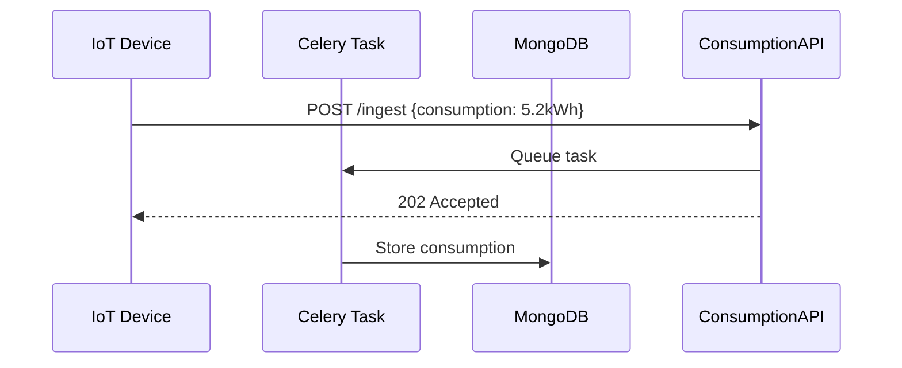
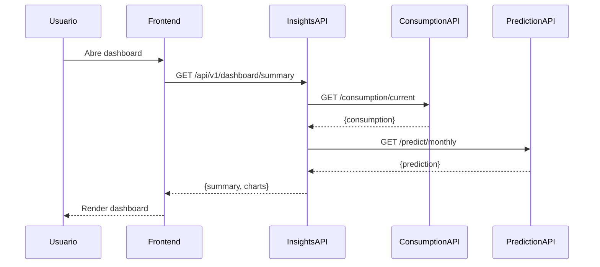
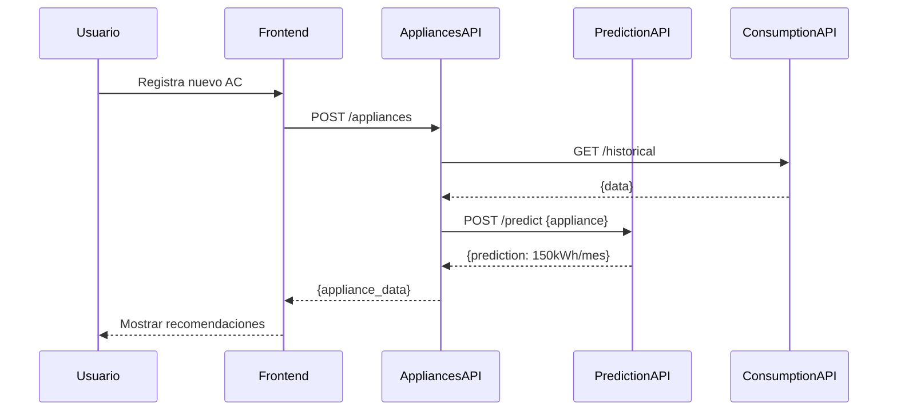

# Documentación Arquitectónica de HarmoniWatts

## 📋 Índice

1. [Diagramas C4 (Structurizr Lite)](#c4-structurizr-lite)
2. [Diagramas de Secuencia (Mermaid)](#secuencia-mermaid)
3. [Diccionario de Datos](#diccionario-de-datos)
4. [Referencias a Confluence](#confluence)

## C4 - Structurizr Lite

### ¿Qué es Structurizr Lite?

Structurizr Lite es una herramienta que permite crear diagramas C4 usando un DSL (Domain Specific Language) simple. Los diagramas se generan automáticamente sin necesidad de posicionamiento manual.

### Cómo Compilar los Diagramas

#### Opción 1: Online (Recomendado para probar)

1. Ir a [Structurizr Lite](https://structurizr.com/dsl)
2. Copiar el contenido de `workspace.dsl`
3. Pegar en el editor online
4. Los diagramas se renderizarán automáticamente

#### Opción 2: Docker Local

```bash
docker run -it --rm -p 8080:8080 -v $(pwd)/docs/architecture:/workspace structurizr/lite:latest
```

Luego abre `http://localhost:8080` en tu navegador.

#### Opción 3: Structurizr CLI (Local)

```bash
# Descargar CLI desde https://github.com/structurizr/cli
structurizr export -workspace workspace.dsl -format plantuml
structurizr export -workspace workspace.dsl -format mermaid
```

### Archivos DSL Disponibles

- **workspace.dsl** - Arquitectura completa del sistema con todos los niveles C4

### Vistas Disponibles en el DSL

1. **System Context** - Vista de alto nivel del sistema con actores externos
2. **Container** - Contenedores principales (Frontend, APIs, BDs)
3. **Consumption Service Component** - Desglose del servicio de consumo
4. **Insights Service Component** - Desglose del servicio de insights
5. **Vivienda API Component** - Desglose del API de viviendas
6. **Electrodomésticos API Component** - Desglose del API de electrodomésticos
7. **Prediction Service Component** - Desglose del servicio de predicción

---

## Secuencia - Mermaid

Los diagramas de secuencia muestran cómo fluye la comunicación entre componentes.

### Flujo 1: Ingesta de Datos



### Flujo 2: Visualización de Dashboards



### Flujo 3: Predicción de Electrodomésticos



---

## Diccionario de Datos

### MongoDB - Consumption Service

**Colección: consumption_readings**
```json
{
  "_id": ObjectId,
  "household_id": "h123",
  "timestamp": ISODate("2026-09-18T12:30:00Z"),
  "consumption_kwh": 5.2,
  "device_id": "meter_001",
  "metadata": {
    "temperature": 25.5,
    "humidity": 60,
    "grid_frequency": 60.0
  },
  "created_at": ISODate("2026-09-18T12:30:00Z")
}
```

**Colección: daily_summaries**
```json
{
  "_id": ObjectId,
  "household_id": "h123",
  "date": ISODate("2026-09-18"),
  "total_consumption_kwh": 45.8,
  "peak_hour": 18,
  "peak_consumption_kwh": 8.5,
  "off_peak_consumption_kwh": 37.3,
  "readings_count": 144
}
```

### PostgreSQL - Vivienda & Electrodomésticos API

**Tabla: households**
```sql
CREATE TABLE households (
  household_id INT PRIMARY KEY,
  user_id INT NOT NULL,
  address VARCHAR(255),
  city VARCHAR(100),
  state VARCHAR(50),
  postal_code VARCHAR(20),
  square_meters FLOAT,
  tariff_type VARCHAR(50),
  created_at TIMESTAMP
);
```

**Tabla: appliances**
```sql
CREATE TABLE appliances (
  appliance_id INT PRIMARY KEY,
  household_id INT NOT NULL,
  name VARCHAR(255),
  type VARCHAR(100),
  power_rating_w FLOAT,
  year_installed INT,
  manufacturer VARCHAR(100),
  estimated_monthly_kwh FLOAT,
  created_at TIMESTAMP,
  FOREIGN KEY (household_id) REFERENCES households(household_id)
);
```

---

## Confluence

Toda la documentación integrada y navegable está en **Confluence**:

🔗 **Espacio:** HarmoniWatts-Documentation  
🔗 **URL:** https://giia.atlassian.net/wiki/spaces/HarmoniWatts

### Estructura en Confluence

```
📋 HarmoniWatts - Documentación Técnica Completa (raíz)
├── 1. Visión General y C4 Context
├── 2. Arquitectura de Contenedores (C4)
├── 3. Microservicios Implementados
│   ├── 3.1 Consumption Service (FastAPI)
│   ├── 3.2 Insights Service (Express.js)
│   ├── 3.3 Vivienda API (Spring Boot)
│   └── 3.4 Electrodomésticos API (Spring Boot)
├── 4. Diagramas de Secuencia
├── 5. Diccionario de Datos
└── 6. Guía de Desarrollo
```

---

## Próximos Pasos

- [ ] Implementar Prediction Service (IA para predicciones)
- [ ] Implementar Tariff Service (actualmente mockado)
- [ ] Agregar tests de integración
- [ ] Configurar CI/CD pipeline
- [ ] Documentar procesos de deployment
- [ ] Crear guía de troubleshooting

---

**Última actualización:** 18 de Septiembre de 2026  
**Estado:** Documentación en desarrollo
